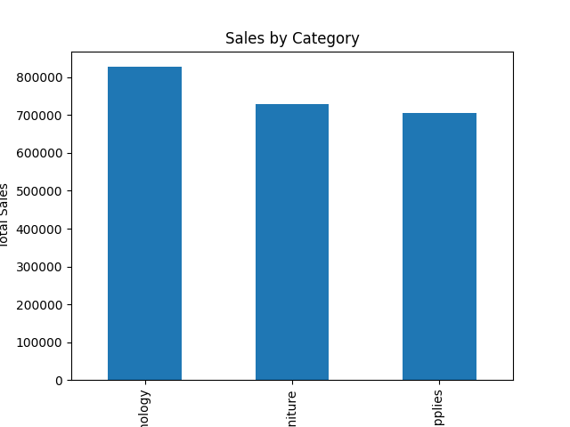
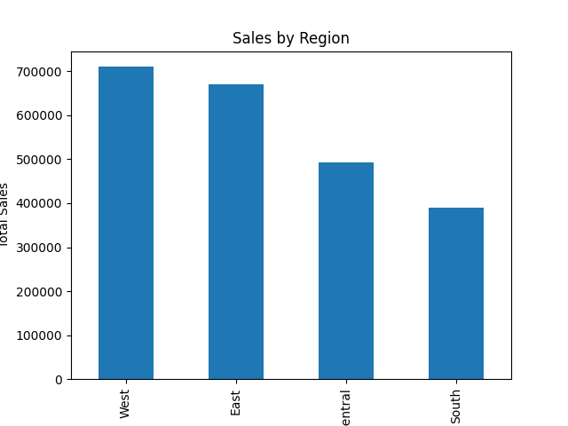
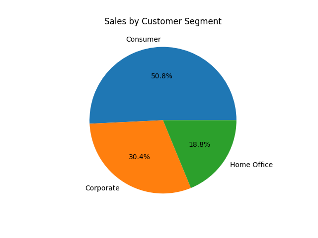
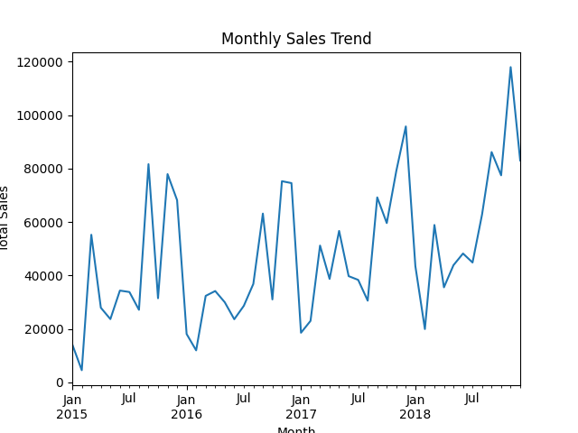
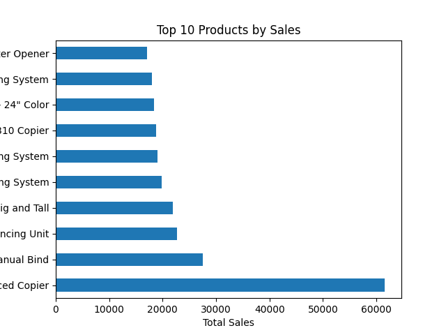

# 📊 Retail Sales Analysis: Customer, Product & Regional Insights

## 📌 Project Overview
This project analyzes retail sales data to uncover key business insights related to sales performance, customer behavior, and product trends. The goal is to help businesses make data-driven decisions.

---

## 📂 Dataset
- The dataset contains information about customer orders, products, and sales.
- It includes details such as order date, region, category, and sales amount.

---

## 🎯 Business Questions
- Which category generates the highest sales?
- Which region performs the best?
- Which customer segment contributes most?
- How do sales change over time?
- What are the top-selling products?

---

## 🧹 Data Cleaning
- Converted date columns into proper datetime format
- Handled missing values in Postal Code
- Removed duplicate records

---

## 📊 Key Insights

### 1. Sales by Category
- Technology generates the highest sales.


### 2. Sales by Region
- West region performs the best.


### 3. Customer Segment
- Consumer segment contributes the most revenue.


### 4. Sales Trend
- Sales show a fluctuating trend with peaks between September and December.


### 5. Top Products
- Top products contribute significantly to overall revenue.


---

## 💡 Business Recommendations
- Increase inventory and marketing efforts during peak months (Sep–Dec)
- Use discounts and campaigns during low months to boost sales
- Focus on high-performing categories like Technology
- Target consumer segment for better revenue growth

---

## 🛠️ Tools Used
- Python (Pandas, NumPy)
- Matplotlib, Seaborn
- Jupyter Notebook

---

## 📁 Project Structure
```
retail-sales-analysis/
│
├── data/
├── notebooks/
├── visuals/
├── README.md
└── requirements.txt
```
